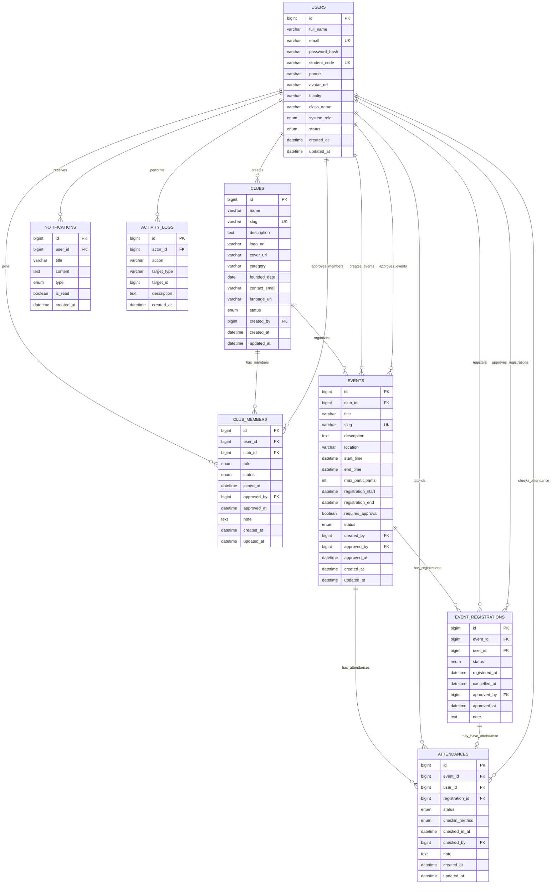

# ERD - Student Club Management System

## 1. Mục đích

Tài liệu này mô tả sơ đồ quan hệ dữ liệu của hệ thống Web quản lý Câu lạc bộ Sinh viên.

ERD giúp xác định:

- Các bảng chính trong hệ thống.
- Các cột quan trọng của từng bảng.
- Khóa chính.
- Khóa ngoại.
- Quan hệ giữa các bảng.
- Luồng dữ liệu giữa người dùng, CLB, thành viên, sự kiện, đăng ký và điểm danh.

## 2. Các bảng trong hệ thống

Database MVP gồm 6 bảng chính:

1. users
2. clubs
3. club_members
4. events
5. event_registrations
6. attendances

Có thể mở rộng thêm:

7. notifications
8. activity_logs

## 3. ERD bằng Mermaid

